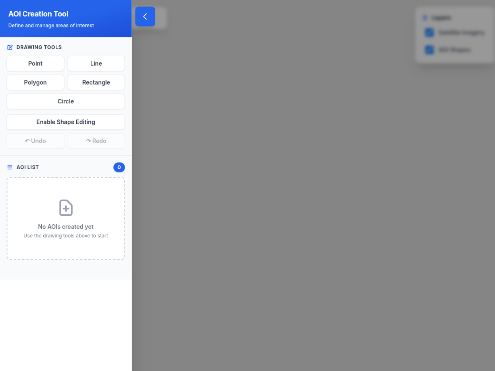
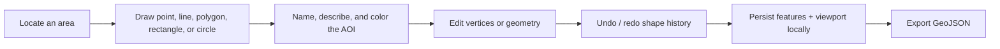
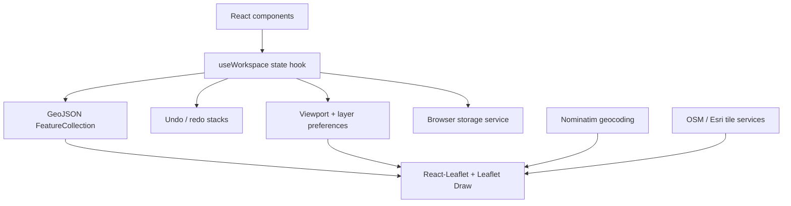

<div align="center">

# FLOWBIT AI

### AREA-OF-INTEREST WORKSPACE


**Draw, edit, organize, and persist geospatial areas of interest directly in the browser.**

[Open the live workspace](https://flowbit-ai.netlify.app) · [API notes](API_DOCUMENTATION.md) · [Development journal](DEV_NOTES.md)

</div>

## Mission control

The image below is a genuine capture of the deployed application. Map tiles are supplied at runtime by external providers, so their availability can vary while the controls and workspace load independently.

[](https://flowbit-ai.netlify.app)

## From blank map to reusable geometry



## Operator console

| Surface | Capability |
|---|---|
| Drawing toolbar | Point, line, polygon, rectangle, and circle creation |
| Shape editor | Vertex and geometry adjustment through Leaflet Draw |
| AOI registry | Named, described, color-coded feature collection |
| Map layers | OpenStreetMap base tiles, Esri World Imagery, AOI visibility |
| Location search | Nominatim geocoding and viewport movement |
| History | Shape-focused undo and redo, including keyboard shortcuts |
| Persistence | Features, viewport, and layer preferences in `localStorage` |
| Interchange | GeoJSON export for downstream spatial tools |

## Spatial architecture



The application deliberately keeps state in one custom hook instead of adding a global state library. That fits a single-workspace product while keeping feature collection, viewport, history, and persistence behavior testable.

## Launch coordinates

```bash
git clone https://github.com/QizarBilal/FlowBit-AI.git
cd FlowBit-AI
npm install
npm run dev
```

Open the Vite URL printed in the terminal, normally `http://localhost:5173`.

```bash
npm run build
npm test
npx playwright test --ui
```

## Repository atlas

```text
src/
├── components/
│   ├── MapView/          Leaflet canvas and draw/edit integration
│   ├── Sidebar/          tools and AOI collection
│   ├── SearchBar.tsx     location lookup
│   ├── MapControls.tsx   viewport actions
│   └── LayerControl.tsx  tile and feature visibility
├── state/workspace.ts    central workspace behavior
├── services/             storage, geometry, geocoding
├── helpers.ts            coordinate utilities
├── types.ts              spatial contracts
└── App.tsx               application composition
```

## Performance contour

| Feature count | Expected experience | Recommended response |
|---:|---|---|
| `< 50` | Optimal interaction | No special handling |
| `50–100` | Smooth with minor bulk delays | Watch render frequency |
| `100–200` | Warning threshold | Consider coordinate simplification |
| `> 200` | Increasing edit/render pressure | Memoize aggressively and profile |

## Known terrain

- Circle geometry behaves differently between creation and edit modes.
- History covers shape changes, not name or description edits.
- Mobile touch drawing works but needs interaction tuning.
- Export currently targets GeoJSON; shapefile output is not included.
- Tile layers and location search rely on third-party network services and their usage policies.

## Verification route

- Create, edit, and delete every supported geometry.
- Refresh and confirm features, viewport, and layer choices return.
- Exercise `Ctrl+Z` and `Ctrl+Shift+Z` through multiple shape mutations.
- Toggle satellite and AOI layers independently.
- Search for a place and confirm the map recenters.
- Export the workspace and validate the resulting GeoJSON.
- Test the warning boundary with a large feature collection.

## License

Released under the [MIT License](LICENSE).

<div align="center">

`LOCATE · DRAW · REFINE · PERSIST · EXPORT`

</div>
